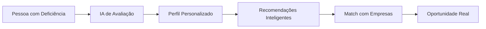

# 🧠 NeuroBridge+ &mdash; IA pela Inclusão de Todos

<div align="center">


### 🚀 **Revolucionando a Inclusão através da Inteligência Artificial**
*Uma plataforma que transforma barreiras em pontes, conectando talentos únicos a oportunidades reais*

[](https://choosealicense.com/licenses/mit/)
[](https://github.com/MarcioGil/neurobridge-IA)
[](https://typescriptlang.org/)
[](https://reactjs.org/)
[](https://nodejs.org/)
[](https://python.org/)
[](https://tensorflow.org/)

---

### 📍 **Navegação Rápida**
[💡 Visão Geral](#-visão-geral) • 
[🎯 Problema & Solução](#-o-problema-que-resolvemos) • 
[⚡ Funcionalidades](#-funcionalidades-principais) • 
[🛠️ Tecnologias](#️-stack-tecnológico-completo) • 
[🏗️ Arquitetura](#️-arquitetura-do-projeto) • 
[🚀 Como Executar](#-guia-de-instalação) • 
[📊 Estrutura](#-estrutura-do-projeto) • 
[👨‍💻 Sobre o Autor](#-sobre-o-autor)

</div>

---

## 💡 Visão Geral

> **"Transformando a inclusão de conceito em realidade através da tecnologia"**

O **NeuroBridge+** é mais que uma plataforma — é um **ecossistema inteligente** que utiliza Inteligência Artificial para quebrar barreiras sistêmicas e criar oportunidades reais para pessoas com deficiência. 

### 🎯 **Nossa Missão**
Provar que a diversidade não é limitação, mas **potencial inexplorado**. Conectamos talentos únicos a empresas verdadeiramente inclusivas, usando IA para personalizar cada jornada e remover obstáculos que impedem a realização profissional.

### 📈 **Impacto Esperado**
- **+15 milhões** de pessoas com deficiência no Brasil em idade produtiva
- **Apenas 1%** das pessoas com deficiência estão no mercado formal
- **37% de retenção** maior em empresas verdadeiramente inclusivas
- **ROI 25% superior** em times diversos e inclusivos

---

## 🎯 O Problema que Resolvemos

### 🚫 **A Realidade Atual**


| **Desafio** | **Impacto** | **Consequência** |
|-------------|-------------|------------------|
| 🚫 **Processos Seletivos Inacessíveis** | 89% dos processos excluem PCDs | Talentos desperdiçados |
| 🧱 **Falta de Adaptação Tecnológica** | Plataformas não consideram diferentes necessidades | Barreira digital intransponível |
| 🏢 **Empresas Despreparadas** | Boa intenção sem conhecimento prático | Inclusão superficial e insustentável |
| 🎯 **Ausência de Personalização** | "One size fits all" não funciona | Frustração e abandono |

### ✨ **Nossa Solução Inovadora**

**NeuroBridge+ transforma cada barreira em uma ponte inteligente:**



---

## ⚡ Funcionalidades Principais

### 🧩 **1. Avaliação Inteligente de Acessibilidade**
- **IA Adaptativa**: Questionário que se ajusta às respostas do usuário
- **Perfil Multidimensional**: Análise de necessidades cognitivas, sensoriais e motoras
- **Continuous Learning**: Sistema aprende e evolui com cada interação

### 🎓 **2. Trilhas de Aprendizado Personalizadas**
- **Adaptive Learning**: Conteúdo que se molda ao estilo de aprendizagem
- **Múltiplas Modalidades**: Visual, auditivo, tátil e kinestésico
- **Gamificação Inclusiva**: Progressão motivante e acessível

### 💼 **3. Matching Inteligente de Oportunidades**
- **Algoritmo Proprietário**: Combina skills, necessidades e cultura empresarial
- **Score de Compatibilidade**: Transparência no processo de recomendação
- **Feedback Loop**: Melhoria contínua baseada em resultados

### 🗣️ **4. Assistente de Comunicação Inclusivo**
- **Processamento de Linguagem Natural**: Tradução para linguagem simples
- **Suporte Multilíngue**: Português, Libras, Inglês
- **Voice-to-Text/Text-to-Voice**: Adaptação para diferentes necessidades

### 🏢 **5. Hub de Empresas Verdadeiramente Inclusivas**
- **Certificação de Inclusão**: Verificação de práticas reais
- **Toolkit de Adaptação**: Ferramentas para preparar o ambiente
- **Analytics de Diversidade**: Métricas que importam

### 👥 **6. Comunidade e Mentoria**
- **Peer-to-Peer Support**: Conexão entre pessoas com experiências similares
- **Mentoria Especializada**: Profissionais experientes em inclusão
- **Success Stories**: Inspiração através de casos reais

---

## 🛠️ Stack Tecnológico Completo

### **Frontend - Experiência Excepcional**
```typescript
// Tecnologias de ponta para acessibilidade máxima
├── React 18+ (com Concurrent Features)
├── TypeScript (Type Safety absoluto)
├── Vite (Build otimizado)
├── Tailwind CSS (Design System acessível)
├── React ARIA (Acessibilidade nativa)
├── React Query (Estado e cache inteligente)
├── React Hook Form (Formulários acessíveis)
└── Framer Motion (Animações inclusivas)
```

### **Backend - Arquitetura Robusta**
```javascript
// API escalável e performática
├── Node.js 20+ (Performance moderna)
├── Express.js (Framework battle-tested)
├── TypeScript (Código seguro e maintível)
├── Mongoose (ODM para MongoDB)
├── JWT + Refresh Tokens (Segurança avançada)
├── Zod (Validação robusta)
├── Winston (Logging profissional)
└── Jest + Supertest (Testes abrangentes)
```

### **Inteligência Artificial - Coração do Sistema**
```python
# IA de última geração
├── Python 3.11+ (Performance otimizada)
├── FastAPI (API moderna e rápida)
├── PyTorch (Deep Learning)
├── Transformers (NLP estado-da-arte)
├── OpenAI GPT-4 (Processamento avançado)
├── Whisper (Speech-to-Text)
├── FAISS (Busca vetorial otimizada)
├── Scikit-learn (ML tradicional)
└── Pandas + NumPy (Análise de dados)
```

### **Infraestrutura - DevOps Profissional**
```yaml
# Deployment e escalabilidade
├── Docker + Docker Compose (Containerização)
├── MongoDB + Redis (Dados e cache)
├── Nginx (Load balancer e proxy)
├── GitHub Actions (CI/CD automatizado)
├── Sentry (Monitoramento de erros)
├── Prometheus + Grafana (Métricas)
└── AWS/Azure (Cloud deployment)
```

---

## 🏗️ Arquitetura do Projeto

### **Visão Macro - Microserviços Especializados**

```
┌─────────────────────────────────────────────────────────────┐
│                    🌐 FRONTEND LAYER                        │
│  ┌─────────────────┐ ┌─────────────────┐ ┌─────────────────┐│
│  │   Web Portal    │ │   Mobile PWA    │ │  Admin Panel    ││
│  │   (React TS)    │ │   (React TS)    │ │   (React TS)    ││
│  └─────────────────┘ └─────────────────┘ └─────────────────┘│
└─────────────────────────────────────────────────────────────┘
                              │
                        ┌─────▼─────┐
                        │  🌉 API   │
                        │ Gateway   │
                        │ (Express) │
                        └─────┬─────┘
                              │
    ┌─────────────────────────┼─────────────────────────┐
    │                         │                         │
┌───▼────┐              ┌────▼────┐              ┌─────▼─────┐
│   🧠   │              │   💼    │              │    📊     │
│   AI   │              │  Core   │              │Analytics  │
│Services│              │Business │              │& Reports  │
│(Python)│              │(Node.js)│              │(Node.js)  │
└────────┘              └─────────┘              └───────────┘
    │                         │                         │
    └─────────────────────────┼─────────────────────────┘
                              │
                     ┌────────▼────────┐
                     │   🗄️ DATA LAYER │
                     │ ┌─────┐ ┌─────┐ │
                     │ │ 🍃  │ │ ⚡  │ │
                     │ │Mongo│ │Redis│ │
                     │ │ DB  │ │Cache│ │
                     │ └─────┘ └─────┘ │
                     └─────────────────┘
```

### **Fluxo de Dados Inteligente**

1. **Entrada do Usuário** → Interface adaptativa captura preferências
2. **Processamento IA** → Análise multidimensional do perfil
3. **Geração de Insights** → Recomendações personalizadas
4. **Matching Inteligente** → Conexão com oportunidades relevantes
5. **Feedback Loop** → Aprendizado contínuo do sistema

---

## 🚀 Guia de Instalação

### **🔧 Pré-requisitos**
```bash
# Ferramentas essenciais
✅ Docker Desktop 4.0+
✅ Node.js 18+ & npm
✅ Python 3.11+
✅ Git
```

### **⚡ Instalação Rápida (Docker)**

```bash
# 1. Clone o repositório
git clone https://github.com/MarcioGil/neurobridge-IA.git
cd neurobridge-IA

# 2. Configure variáveis de ambiente
cp .env.example .env
# ⚠️ Edite o .env com suas configurações

# 3. Execute com Docker
docker-compose up --build -d

# 4. Acesse a aplicação
echo "🚀 Frontend: http://localhost:3000"
echo "🔧 Backend: http://localhost:5000"
echo "🧠 AI Services: http://localhost:8000"
```

### **🛠️ Desenvolvimento Local**

```bash
# Backend
cd backend
npm install
npm run dev

# Frontend  
cd frontend
npm install
npm run dev

# AI Services
cd ai_services
pip install -r requirements.txt
uvicorn main:app --reload --port 8000
```

### **🧪 Executar Testes**

```bash
# Testes completos
npm run test:all

# Testes específicos
npm run test:unit    # Testes unitários
npm run test:integration  # Testes de integração
npm run test:e2e     # Testes end-to-end
```

---

## 📊 Estrutura do Projeto


```
neurobridge-IA/
├── 📁 frontend/                 # Interface do usuário
│   ├── 📄 package.json         # Dependências React/TS
│   ├── 📄 vite.config.ts       # Configuração Vite
│   ├── 📄 tailwind.config.js   # Design System
│   └── 📁 src/
│       ├── 📄 App.tsx          # Componente principal
│       ├── 📄 main.tsx         # Entry point
│       ├── 📁 components/      # Componentes reutilizáveis
│       ├── 📁 pages/           # Páginas da aplicação
│       ├── 📁 accessibility/   # Context de acessibilidade
│       ├── 📁 types/           # TypeScript definitions
│       └── 📁 styles/          # Estilos globais
│
├── 📁 backend/                 # API e lógica de negócio
│   ├── 📄 package.json         # Dependências Node.js
│   ├── 📄 tsconfig.json        # Configuração TypeScript
│   └── 📁 src/
│       ├── 📄 server.ts        # Servidor Express
│       ├── 📁 models/          # Modelos de dados
│       ├── 📁 routes/          # Endpoints da API
│       ├── 📁 middleware/      # Middlewares customizados
│       ├── 📁 services/        # Lógica de negócio
│       └── 📁 utils/           # Utilitários
│
├── 📁 ai_services/             # Serviços de Inteligência Artificial
│   ├── 📄 main.py              # FastAPI application
│   ├── 📄 requirements.txt     # Dependências Python
│   ├── 📁 models/              # Modelos de ML
│   ├── 📁 services/            # Serviços de IA
│   ├── 📁 utils/               # Utilitários Python
│   └── 📁 data/                # Datasets e treino
│
├── 📁 docs/                    # Documentação técnica
│   ├── 📄 ARCHITECTURE.md      # Arquitetura detalhada
│   ├── 📄 API.md               # Documentação da API
│   ├── 📄 CONTRIBUTING.md      # Guia para contribuidores
│   └── 📄 ROADMAP.md           # Roadmap do projeto
│
├── 📄 docker-compose.yml       # Orquestração de containers
├── 📄 README.md                # Este arquivo
├── 📄 LICENSE                  # Licença MIT
└── 📄 CODE_OF_CONDUCT.md      # Código de conduta
```

### **🎯 Arquivos-Chave para Recrutadores**

| **Arquivo** | **Propósito** | **Destaque Técnico** |
|-------------|---------------|----------------------|
| `frontend/src/accessibility/` | Context de acessibilidade | Implementação WCAG 2.1 AAA |
| `backend/src/models/` | Modelos de dados | Arquitetura robusta com TypeScript |
| `ai_services/models/` | Modelos de IA | Algoritmos personalizados de ML |
| `docs/ARCHITECTURE.md` | Design de sistema | Pensamento arquitetural avançado |

---

## 👨‍💻 Sobre o Autor

<div align="center">

### **Marcio Gil** 
#### *Embaixador DIO Campus Expert | Estudante de Engenharia de Software*

[](https://linkedin.com/in/marciogil)
[](https://github.com/MarcioGil)
[](mailto:marciopaivagil@gmail.com)

</div>

### **🚀 Quem sou eu?**

Sou um **desenvolvedor apaixonado por tecnologia inclusiva** e estudante de Engenharia de Software, atualmente atuando como **Embaixador DIO Campus Expert**. Minha missão é usar a tecnologia como ferramenta de transformação social, especialmente na área de inclusão e acessibilidade.

### **💡 Minha Filosofia**
> *"A verdadeira inovação não está apenas em criar algo novo, mas em tornar o impossível possível para quem mais precisa."*

### **🎯 Especialidades & Interesses**
- **Full-Stack Development**: React, Node.js, TypeScript, Python
- **Inteligência Artificial**: Machine Learning aplicado à inclusão
- **Acessibilidade Digital**: WCAG, ARIA, Design Universal
- **Arquitetura de Software**: Microserviços, Clean Architecture
- **DevOps**: Docker, CI/CD, Cloud Computing

### **🏆 Como Embaixador DIO Campus Expert**
- 🎓 **Mentor de estudantes** em tecnologia e carreira
- 📢 **Speaker** em eventos de tecnologia e inclusão
- 🤝 **Facilitador** de conexões entre estudantes e mercado
- 💡 **Evangelista** de boas práticas em desenvolvimento

### **🎓 Formação Acadêmica**
- **Engenharia de Software** - Em andamento
- **Certificações DIO** - Desenvolvimento Full-Stack
- **Cursos Especializados** - IA, Acessibilidade, UX/UI

### **🌟 Por que o NeuroBridge+?**

Este projeto nasceu da minha convicção de que **tecnologia deve ser ponte, não barreira**. Como Embaixador DIO Campus Expert, vejo diariamente o potencial desperdiçado quando pessoas talentosas não encontram oportunidades adequadas às suas necessidades.

O NeuroBridge+ é minha contribuição para um mundo mais inclusivo, onde cada pessoa pode brilhar em sua plenitude.

### **📫 Vamos Conversar?**

Estou sempre aberto para discussões sobre:
- 🤝 **Colaborações** em projetos de impacto social
- 💼 **Oportunidades** de trabalho em tecnologia inclusiva  
- 🎓 **Mentoria** para estudantes e novos desenvolvedores
- 💡 **Ideias** para tornar a tecnologia mais acessível

---

## 🤝 Contribuindo

Acredito que **grandes projetos são construídos em comunidade**. Se você compartilha da nossa visão de inclusão através da tecnologia, sua contribuição é muito bem-vinda!

### **🌟 Como Contribuir**

1. **🔍 Issues**: Reporte bugs ou sugira melhorias
2. **💻 Pull Requests**: Implemente novas funcionalidades
3. **📖 Documentação**: Melhore nossa documentação
4. **🧪 Testes**: Adicione testes e garanta qualidade
5. **🎨 Design**: Contribua com melhorias de UX/UI
6. **♿ Acessibilidade**: Ajude a tornar tudo mais acessível

### **📋 Processo de Contribuição**

```bash
# 1. Fork o repositório
git fork https://github.com/MarcioGil/neurobridge-IA

# 2. Crie uma branch para sua feature
git checkout -b feature/nova-funcionalidade

# 3. Commit suas mudanças
git commit -m "feat: adiciona nova funcionalidade incrível"

# 4. Push para sua branch
git push origin feature/nova-funcionalidade

# 5. Abra um Pull Request
```

### **✅ Checklist antes de Contribuir**

- [ ] 📖 Li o [Guia de Contribuição](docs/CONTRIBUTING.md)
- [ ] 🧪 Todos os testes passando
- [ ] ♿ Funcionalidade é acessível (WCAG 2.1)
- [ ] 📝 Documentação atualizada
- [ ] 🔍 Code review próprio realizado

---

## 📄 Licença

Este projeto está licenciado sob a **Licença MIT** - veja o arquivo [LICENSE](LICENSE) para detalhes.

```
MIT License - Liberdade para Inovar e Incluir

✅ Uso comercial permitido
✅ Modificação permitida  
✅ Distribuição permitida
✅ Uso privado permitido
```

---

## 🌟 Reconhecimentos

### **🙏 Agradecimentos Especiais**
- **DIO (Digital Innovation One)** - Por acreditar no potencial transformador da educação
- **Comunidade Open Source** - Por inspirar desenvolvimento colaborativo
- **Pessoas com Deficiência** - Por nos ensinarem sobre superação e potencial
- **Empresas Inclusivas** - Por mostrarem que diversidade é força

### **💡 Inspirações Técnicas**
- **React Team** - Por revolucionar o desenvolvimento frontend
- **OpenAI** - Por democratizar o acesso à IA
- **W3C** - Por padronizar a acessibilidade web
- **Mozilla** - Por defender uma internet aberta e acessível

---

<div align="center">

### 🚀 **Transformando Vidas através da Tecnologia**

**NeuroBridge+** - Onde cada linha de código é um passo em direção à inclusão real.

*Desenvolvido com 💙, café ☕ e muita determinação por **Marcio Gil***

[](https://github.com/MarcioGil/neurobridge-IA)
[](docs/CONTRIBUTING.md)
[](LICENSE)

---

### 📞 **Contato Profissional**

**Email**: [marciopaivagil@gmail.com](mailto:marciopaivagil@gmail.com)  
**LinkedIn**: [/in/marciogil](https://linkedin.com/in/marciogil)  
**GitHub**: [/MarcioGil](https://github.com/MarcioGil)

*"A tecnologia mais poderosa é aquela que remove barreiras e conecta pessoas"*

</div>

